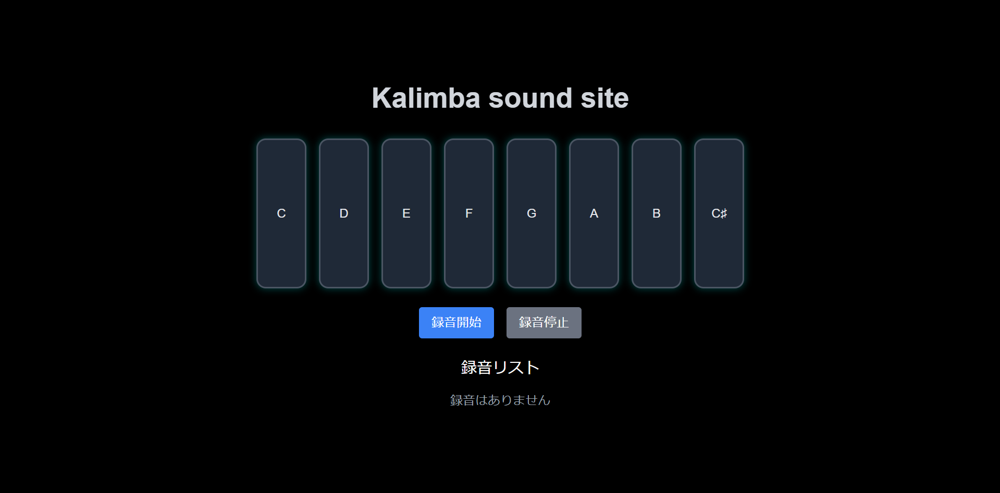

# Kalimba Sound Site
## 開発の理由
たまたまyoutube shortに流れてきたカリンバという楽器に興味を持ち、実際に買ってみると非常に満足することができたのでこれを再現、試奏できないか？と考え、このアプリを作成しました。

## 概要
カリンバの音をシミュレーションできるWebアプリです。画面上のボタンをクリックすることで音を鳴らすことができ、録音・再生機能も備えています。また、一定時間操作がない場合に自動演奏が開始される機能も実装しています。

## 機能
- **カリンバの演奏**
  - 画面上のボタンをクリックすると、対応する音(ド~高いドまでの音)が再生されます。
- **録音機能**
  - 「録音開始」ボタンを押すと、押した音とそのタイミングを記録します。
  - 「録音停止」ボタンを押すと録音を保存します。
- **録音の再生・削除**
  - 保存した録音をリストから選択して再生できます。
  - 必要ない録音は削除できます。
- **自動演奏機能**
  - 30秒間操作がない場合に、「喜びの歌」のメロディーが自動で演奏されます。

## 使用技術
- **React**（useState, useEffectを使用）
- **Howler.js**（音声の再生を管理）
- **Tailwind CSS**（UIデザイン）

## アプリ画面

## 今後の改善点
- スマートフォン向けのUI改善
- 他のメロディーの自動演奏機能の追加
- ローカルストレージへの録音保存など